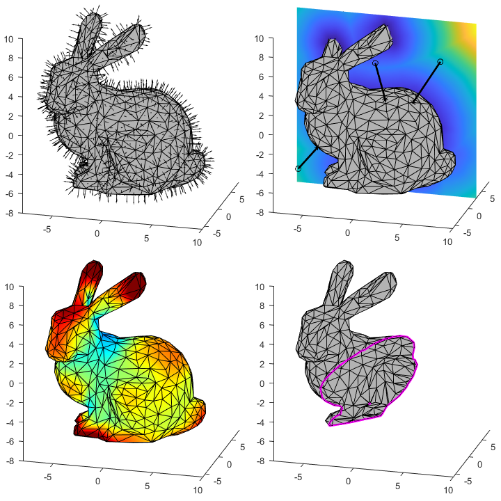

# MatGeom
MATLAB geometry processing library in 2D/3D.

[](https://fr.mathworks.com/matlabcentral/fileexchange/107370-matgeom)
[](https://doi.org/10.5281/zenodo.5768192)

**MatGeom** is a library for geometry processing / geometric computing with MATLAB in 2D and 3D. 
MatGeom is a “function-based” library: it contains several hundreds of functions for the creation,
manipulation and display of 2D and 3D shapes such as point sets, lines, ellipses, polygons, 
3D polygonal meshes, ...
The official homepage for the project is http://github.com/mattools/matGeom. 

A [user manual](https://github.com/mattools/matGeom/releases/download/v1.2.8/matGeom-manual-1.2.8.pdf) 
containing a large number of illustrations and examples is available.
Starting from February 2022, the HTML pages of the functions (obtained with m2html) are available 
[here](https://mattools.github.io/matGeom/api/index.html).

The MatGeom library corresponds to the concatenation of the 
"[geom2d](https://fr.mathworks.com/matlabcentral/fileexchange/7844-geom2d)" 
and 
"[geom3d](https://fr.mathworks.com/matlabcentral/fileexchange/24484-geom3d)" 
libraries that were distributed on the FileExchange. Distribution as a single library greatly 
facilitates the interoperability of the functions.

If you use matGeom for your research, please be kind enough to cite the following article:
* [Legland, D. MatGeom: A toolbox for geometry processing with MATLAB](https://www.sciencedirect.com/science/article/pii/S2352711024003546). 
*SoftwareX*, **29**, 101984, (**2025**). DOI:10.1016/j.softx.2024.101984


## Package organization
The library is organized into several modules:
* [geom2d](https://github.com/mattools/matGeom/wiki/geom2d "geom2d Wiki page") - General functions in Euclidean plane
* [polygons2d](https://github.com/mattools/matGeom/wiki/polygons2d "polygons2d Wiki page") - Functions operating on polygons and polylines represented as list of vertices
* [graphs](https://github.com/mattools/matGeom/wiki/graphs "graphs Wiki page") - Manipulation of geometric graphs
* [geom3d](https://github.com/mattools/matGeom/wiki/geom3d "geom3d Wiki page") - General functions in 3D Euclidean space
* [meshes3d](https://github.com/mattools/matGeom/wiki/meshes3d "meshes3d Wiki page") - Manipulation of 3D polygonal meshes (trimesh, quadmesh, or more generic meshes)

## Quick overview

### Fit geometries to point data
Basic functionalities comprise creation of simple geometries such as points, lines, ellipses... 
A simple example is provided with the following script.

```matlab
% load data
iris = load('fisheriris');
pts = iris.meas(:, [3 1]);
% display
figure; axis equal; hold on; axis([0 8 3 9]);
drawPoint(pts, 'bx');
% Fit line
line = fitLine(pts);
drawLine(line, 'color', 'k', 'linewidth', 2);
% Draw oriented box of whole data set
obox = orientedBox(pts);
drawOrientedBox(obox, 'color', 'k', 'linewidth', 1);
% identifiy species index
[labels, ~, inds]= unique(iris.species);
% for ech species, compute equivalent ellipse and display with axes
colors = [1 0 0; 0 0.8 0; 0 0 1];
for i = 1:3
    pts_i = pts(inds == i, :);
    drawPoint(pts_i, 'marker', 'x', 'color', colors(i,:), 'linewidth', 2);
    elli = equivalentEllipse(pts_i);
    drawEllipse(elli, 'color', colors(i,:), 'linewidth', 2)
    drawEllipseAxes(elli, 'color', colors(i,:), 'linewidth', 2)
end
```


### Polygon data processing

It is possible to work with more complex shapes such as polygonal lines ("polylines") or polygons.
Common operations comprise smoothing, simplification (retaining only a selection of vertices), 
computation of convex hull or of intersections with other geometric primitives. 
A summary of typical operations in presented in the following script.
```matlab
% read polygon data as a numeric N-by-2 array
poly = load('leaf_poly.txt');

% display the polygon using basic color option
figure; axis equal; hold on; axis([0 600 0 400]);
drawPolygon(poly, 'k');

% Bounding box of the polygon
poly_bnd = boundingBox(poly);
drawBox(poly_bnd, 'k');

% computes convex hull of polygon vertices
poly_hull = convexHull(poly);
drawPolygon(poly_hull, 'LineWidth', 2, 'Color', 'k');

% applies smoothing to the original polygon.
poly_smooth = smoothPolygon(poly, 51);
drawPolygon(poly_smooth, 'color', 'b', 'linewidth', 2);

% Computes a simplified version of the polygon
poly_simpl = simplifyPolygon(poly, 20);
drawPolygon(poly_simpl, 'color', 'r', 'linewidth', 2);
drawVertices(poly_simpl, 'Color', 'k', 'Marker', 's', 'MarkerFaceColor', 'w');

% compute intersections with an arbitrary line
line = createLine([0 250], [600 350]);
drawLine(line, 'k');
inters = intersectLinePolygon(line, poly_simpl);
drawPoint(inters, 'Color', 'r', 'Marker', 'o', 'MarkerFaceColor', 'w', 'linewidth', 2);
```


### Polygon mesh processing

The MatGeom library also provides features for polygon mesh processing.
Mesh data can be retrieved from common mesh file formats, 
or generated from simple data,
and various operations can be performed: intersections (with lines or planes), clipping by plane, 
distance to point... 
Several measurements on meshes are also provided: main curvatures, surface area, bounding box...


